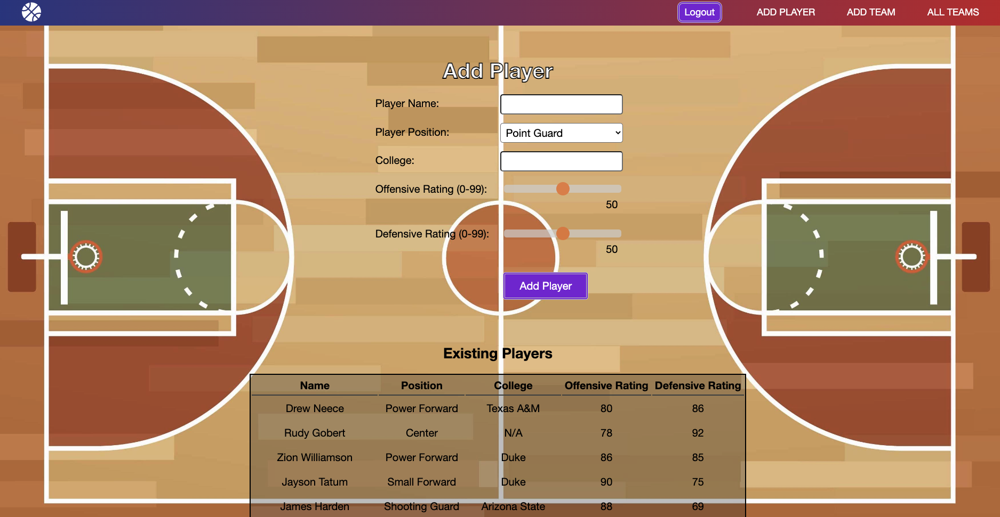

# 2K Create-A-Team

# [Open the App Here!](https://drewneece-create-a-team.fly.dev/)

This application simulates the popular MyLeague game mode in the NBA 2K video game series, where users can create and customize their team and roster. In this version, users can create a team that includes the city, mascot, conference, both primary and secondary colors, and roster. Users are also able to create individual players that can then be added to the user's team roster. The players can be customized by adding their names, positions, colleges, and offensive and defensive skill ratings. The user has the freedom to create a real NBA team, imaginary team, NBA player, imaginary player, or themselves! The user has the ultimate creative freedom, as long as they are signed in through Google. Users not signed in will only be able to view existing teams.

[View Planning Materials Here](https://trello.com/b/cuc6OzFt/unit-2-project)

# Technologies Used 💾
- JavaScript
- HTML
- CSS
- Node.js
- Express
- MongoDB
- Mongoose
- EJS
- git

# Credits 🙌
- This app uses BasketballCourt-HQ-01.jpg from [Vexels](www.vexels.com)
- This app uses this Basketball favicon: [freeiconspng](https://www.freeiconspng.com/downloadimg/26241)

# Ice Box 🧊
- [ ] Only allow each player in the database to be on one team's roster.
- [ ] TBD
- [ ] TBD